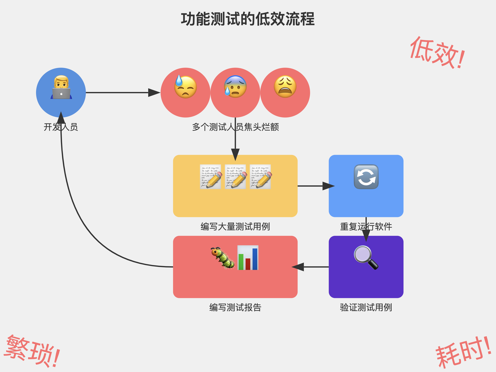
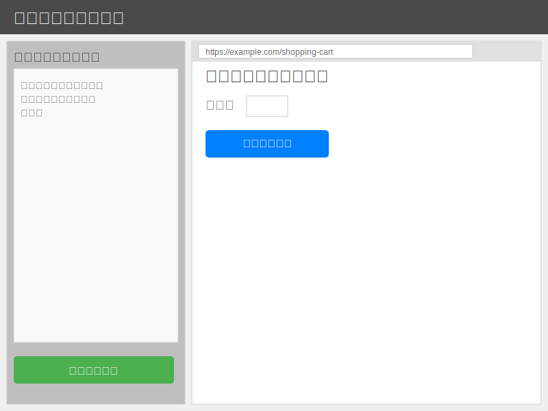
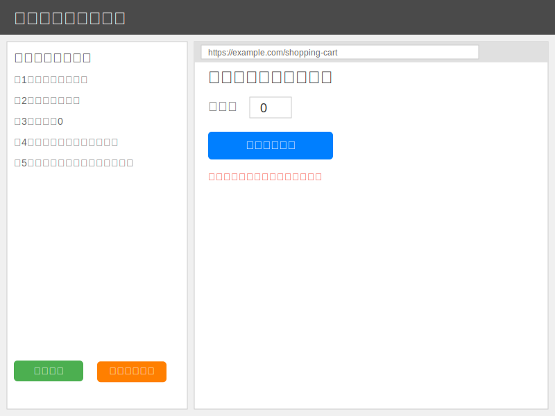
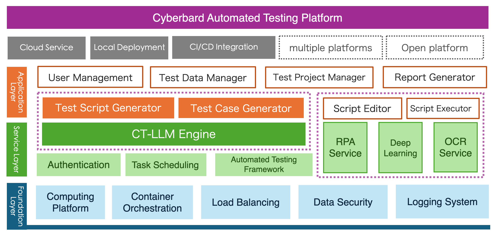

# Business Plan for Cyberbard

by Heng Tian

date [08/2024]

----

# 1 Business Summary

## 1.1 Introduction

Cyberbard LTD是一家位于 London 的AI初创企业。我们的产品“Cyberbard”通过设计和训练一种先进的测试领域专用AI大模型（LLM），可以模仿真实测试人员的意图和操作，让广大测试资源不足的中小软件公司通过我们的平台，自动化完成“功能测试”的全部步骤，降低测试成本，加快新产品上线速度。

## 1.2 What’s the current market problem?

<!-- 介绍发现的市场痛点。1-2个即可，不要写超过3个。 -->
“功能测试”是软件研发中非常重要的一环。具体来说，“功能测试”是对软件整体的界面，交互进行的测试，需要多个经验丰富的测试人员才能完成，工作包括分析新增功能，编写测试用例，反复运行这些用例找到产品的问题，写测试报告反馈整个功能的最终可用性给开发人员。
具体如下图所示：

这里面的每一步都非常繁琐耗时，实际操作的时候非常有可能出现疏漏。而为了抓住市场机会，软件产品的迭代速度往往非常之快，而很多中小软件企业主要资源用在新产品的开发上，往往没有足够的测试人员来配合新功能的测试。最后的结果就是，部分中小型公司为了保障产品上线速度，只能忽视“功能测试”的重要性，让其他人员兼职测试，简化甚至省略一些步骤，造成产品质量的下降。

如果是大型的团队，可以有足够的资源配备大量的人力来测试，或者将整个测试工作外包给第三方来完成。但是对于广大中小团队，还需要更好的解决方法。如果有一种工具可以让“功能测试”尽可能的自动化低成本完成，将会对中小型团队非常有吸引力。

## 1.3 Our solution and USP

<!-- 针对上面发现的痛点提出解决方案以及你的独家卖点（USP） -->
虽然市面上已经有一些测试工具来实现一定的自动化“功能测试”能力，但是整体来看依然有很大的改进空间。

最常见的解决方案是让测试人员编写某种测试脚本。测试工具通过读取这些脚本可以控制界面的操作。然后，测试工具反复的自动运行这些脚本来进行“功能检测”。但是这样会让脚本的编写成为了一个瓶颈。要求测试人员编写脚本代码会极大提高测试人员的工作量，而且不同的测试工具还有不同的脚本，这些能力并不通用，花了很大精力培养的测试人员，可能换一个测试工具，就又需要重新学习。随后也出现了一些低代码的测试工具，可以通过“录制”等方式来加快脚本编写，但是依然需要测试人员手动操作一遍才能形成脚本。问题是软件产品变化很快，之前花了很多时间录制的脚本，可能因为一个按钮改动，需要批量修改，往往会造成测试人员没有精力修改以前的脚本。也就是说，如果测试资源不足，脚本很容易过时而被废弃。最后，这些测试工具还可能相当复杂和昂贵，需要配套其他软件项目管理软件才能使用，甚至学习如何使用它们都需要专门的人员培训，一般的中小企业也很难负担。

如何让测试资源不足的中小软件企业也能轻松的做好“功能测试”，最重要的是使用自动化的工具来帮助测试人员自动编写测试用例，生成脚本，并且可以自动维护这写脚本。这样让整个“功能测试”的所有环节都可以实现自动化。

现在 LLM（大语言模型）的技术日新月异，让这个以前是实现起来很困难的问题有了更好的解决方案。 Cyberbard 结合基于创始人多年来和各种规模的产研团队的合作经验，收集了大量测试相关的行业数据，计划训练出一种专门为功能测试人员服务的AI模型，只需要测试人员使用自然语言提供关于本次新增功能的简单描述，我们的平台就可以自动拆分产品细节，编写测试用例，生成测试脚本，然后自动化运行这些脚本。测试人员要做的就是审核这些脚本，然后等待系统最终的测试报告。当产品有改动的时候，我们的AI模型也会自动去修改相关脚本，避免测试人员的重复劳动。

总之， Cyberbard 的USP就是：通过专用的AI模型，将之前最耗时的“编写测试用例”和“生成脚本”的部分进行了自动化，让测试的自动化程度进一步提高。这样的话，测试人力资源的不足和对软件质量的担忧也不再成为中小软件公司发展的障碍。产研团队可以集中力量到新产品的迭代，用更低的成本。

## 1.4 Feasibility Study

<!-- 可行性研究的内容。商业验证的内容在这里体现。 -->
### 1.4.1 Market Feasibility

根据GMI的预测，未来10年全球软件测试行业依然保持7%的年增长率，应用测试自动化市场规模预计到2032年底将超过973亿美元. 其中小微企业数量占比达95%. 根据statista的一份报告，25.60%的小企业的测试人员占比少于10%，26.2%的小企业的测试预算占比少于10%。说明很多中小软件企业需要新的自动化工具来弥补测试资源不足的问题。

目前 Cyberbard 的官网已经开启了等待列表，网页的访客可以在线填写邮箱获取最新的消息，已经有超过1000位测试人员愿意第一时间尝试我们的产品，我们的官方社交媒体上有超过1000人的关注者，官网的介绍blog超过1万人阅读。同时，还有10家公司和我们签订了首批意向合同。很多潜在用户表示，非常期待出现帮助他们节省测试成本的工具。

### 1.4.2 Technical feasibility

目前基于通用大模型训练专用模型的工具比较成熟，很多的开源工具免费提供，考虑使用开源大模型 LLaMA 等节省成本，只需要普通的但是关于功能测试的相关数据还比较少，预计训练专用模型需要一定的时间成本，计划使用半年的时间训练完成。 自动化测试工具也比较成熟，可以基于开源工具 selenium 等进行改造，加快MVP研发进度，尽早获得用户反馈。

目前已经开始一些技术验证工作，计划2024年4季度第一版本的模型训练成功，提供MVP，可以小范围为首批尝鲜用户提供服务，针对用户的反馈进行优化。2025年逐渐增加计划中的能力，第1季度发布第一个公开收费版本，提供最基础的功能，首先支持Web平台应用，包括AI测试用例生成，管理后台，会员计费等功能，2025年第2季度，提供多种脚本导出，兼容其他测试系统，第3季度支持API开放，方便通过CI/CD整合到其他平台。第4季度扩充能力，支持“产品优化建议”和“交互优化建议”。

### 1.4.3 Financial feasibility

本项目主要启动资金来自于创始人的自有存款150000英镑，计划到2024年底主要工作是MPVP研发，主要员工是创始人自己，工资支出10000英镑，其他成本2000英镑。2025年版本上市以后，增加一名市场营销专员，工资支出40000镑，市场营销费用50000镑，计划试用用户10000人，收费用户100人，收入100000英镑，大客户5人，收入50000英镑。计划在2025年第二季度达到盈亏平衡点（BEP），详细情况可以看后面章节的分析。

# 2 COMPANY DETAILS

## 2.1 Why Choose the UK?

<!-- 说明你为什么来英国开这家公司。你看中了英国的什么？或者说为什么你认为英国跟个适合你来做这个事情。 -->
英国政府对AI和科技创新的高度重视，以及相关的政策和资金支持，如“Industrial Strategy: Artificial Intelligence Sector Deal”政策，为AI初创企业提供了极大的发展空间和机会。英国有一个稳定且透明的法律体系，保护知识产权，并支持科技创新。

英国的软件测试公司主要还是传统的大型企业为主，倾向于服务大型集团和制定行业标准，而位于美国硅谷的一些高科技公司，已经开始研究使用最新的AI技术来改造软件测试行业，比方Datadog，katalon等。 Cyberbard LTD 的创立和发展可以在AI自动化测试领域，为英国提供更多的国际竞争力。

## 2.2 Why London?

<!-- 说明为什么选择这个城市作为你的公司运营的地点。一般可以从人才、成本、市场等角度来阐述。 -->
London是世界知名的城市，选择这个城市作为总部，主要因为这里聚集了丰富的专业人才资源。该城市拥有多所知名大学和研究机构，也从全球吸引大量人工智能、数据科学、工程技术等领域的高素质毕业生和行业专家，能够为公司提供强大的人才支持。同时，伦敦作为全球金融中心之一，有大量的孵化器、加速器和创业社区，为初创企业提供了丰富的融资渠道和投资机会。

同时，相比其他城市，London为初创企业提供了各种各样的办公空间选择，可以用比较低的价格得到比较专业的面向全球市场的形象。该城市的地方政府提供了一系列对初创企业友好的政策支持，如税收减免、创业补贴等，有助于降低运营成本，增强企业的竞争力。

作为一家为企业服务的公司，所在城市本身也是我们的重点市场。London位于关键市场的中心地带，本身也拥有大量的初创软件企业，可以拉近我们与主要客户和合作伙伴的距离，便于开展业务和建立关系。无论是本地市场还是周边地区的市场需求，都能迅速响应和满足。

London也以宜居的生活质量和多元化，国际化而知名，成为全球人才的交汇点，这和 Cyberbard LTD 的经营理念不谋而合，我们也致力于为全球AI人才提供更多在London发展的机会。

# 3 Production and Services

## 3.1 Cyberbard Target Clients

<!-- 公司主要客户的画像。 -->
Cyberbard 主要面向中小型软件公司和企业。具体来说，这些企业通常具有以下特点：

- 员工规模一般不超过100人。这类公司规模较小，内部资源相对有限，尤其在技术和测试领域的人员配置上较为紧张。
- 年收入通常不超过1000万美元，但是有比较稳定的客户来源，收入水平较为稳健，虽然投入高昂的测试费用上有一定的局限性，但是也有进一步提高软件质量的需求。
- 行业领域主要集中在软件开发、SaaS、网页应用开发等技术驱动型行业。这些企业通常以开发面向特定市场的创新型软件产品为主。往往需要快速开发产品抢占市场，留给测试的时间和资源比较少。

此类企业经常面临以下测试方面的挑战：

- 测试资源匮乏：由于资金和人员限制，这些企业往往没有专门的测试团队，开发人员需要分担测试任务，这不仅影响开发效率，还可能导致测试质量不高。
- 测试周期长：传统的手动测试或半自动化测试方式，耗时较长，容易导致产品迭代周期拉长，从而错失市场机会。
- 测试质量参差不齐：由于缺乏系统化的测试方法和工具，导致测试覆盖率不足、测试深度不够，产品可能存在较多的bug和潜在风险。
- 技术升级的压力：面对快速变化的市场环境，这些企业需要频繁更新和迭代产品功能，然而由于测试流程不完善，常常难以在保证质量的前提下快速发布新版本。

这些中小企业的主要目标是加快产品的上市速度、提升产品的质量、优化开发和测试流程，从而在竞争激烈的市场中保持优势。具体而言：

- 降低开发和测试成本：希望通过引入自动化测试工具减少手动测试的需求，从而降低人力成本和时间成本。
- 提高产品质量：通过更全面和高效的测试手段，减少产品在发布后的bug数量，提升用户满意度和品牌声誉。
- 加快产品迭代：希望通过缩短测试周期，能够更快地响应市场需求，实现频繁的版本更新，从而抢占市场先机。

在这些企业中，由于公司规模不大，购买决策可能由CTO和团队主管共同作出。所以，一方面Cyberbard 需要在技术上有一定的创新，让CTO感觉到独特的技术价值，同时也要在使用上明白直观，让团队主管对我们的平台的便利性有直接的体验。

## 3.2 How Cyberbard works

<!-- 公司提供的产品/服务的介绍。不用过于详细，但是要说清楚。让阅读BP的人看完这段之后就知道你做的到底是什么。 -->
近年来，应用程序已经成为我们日常生活中不可或缺的一部分，有数以百万计的应用程序可以通过手机或者电脑使用。随着应用程序在我们日常生活中的重要性日益增加，对于应用程序开发者来说，确保他们的应用程序具有高质量并且对用户来说按预期执行变得越来越重要。

通常对软件的测试可以划分为3种：单元测试，整合测试和功能测试。前面两种测试和开发人员关系比较密切，已经有一些工具来降低成本。但是“功能测试”依然需要专业的测试人员来执行和完成，具体分工如下图所示：

“功能测试”的主要流程分为以下几个步骤：

- 首先需要和产品经理，研发人员充分交流，了解产品的每一个细节；
- 然后根据掌握的细节来需要编写测试用例，每条用例代表一类用户的可能操作。如果有遗漏，则可能造成软件质量下降；
- 根据测试用例，编写测试脚本或者直接手动测试，验证每条测试用例。
- 测试人员记录下测试用例的通过情况，反馈出现问题的用例的操作路径给开发人员修改，并且验证修改结果。

这里通过一个简单的例子来说明 Cyberbard 基本的运作方式。比方产品为一个购物网站新增加了一个功能，之前添加购物车的时候不能选择数量，现在多了一个输入框，用户自己可以输入数量。传统的流程下，测试人员首先需要理解产品需求，手动为这个新功能编写测试用例。
这个测试人员可能会增加下以下三条测试用例：

- 点击“数量”输入框，输入“ABC”，点击“添加购物车”按钮，系统应该提示“只能使用数字作为商品单位”。
- 点击“数量”输入框，输入“0”，点击“添加购物车”按钮，系统应该提示“至少购买1个商品”。
- 不点击“数量”输入框，直接点击“添加购物车”按钮，系统应该默认购买1个商品。
  
可见，测试人员的工作量随之增加了，不但要测试这三条新的用例，可能之前的“购物车”相关功能也需要回归测试一次，保证没有影响到其他的功能。这个过程非常消耗人和物力，而且基本上靠人工来编写测试用例，对测试人员的要求很高，而且很容易出现测试用例无法覆盖全面的情况，这意味着可能会错过重要的错误和问题。

如果使用 Cyberbard 平台，测试人员只需要简单输入本次的测试任务，上述步骤都可以通过平台的AI模型自动化完成。下面是具体步骤的详细说明和截图。

首先，测试人员使用自然语言“添加购物车新增了输入商品数量功能”告诉平台本次新增加的功能，点击“生成测试用例”按钮，AI模型就可以自动访问软件页面，读取页面中的文字和可交互元素，生成测试用例，图片的右边就是等待测试的软件界面。

然后，平台在列出所有的测试用例，测试人员继续点击“生成测试脚本”按钮，系统会根据之前收集到的可交互的元素，自动推测每一条测试用例的操作脚本，比方先定位到哪个按钮，然后需要输入什么，然后需要进入哪个新的页面，直到找出完成整个用例的路径。每条测试用例都会生成对应的测试脚本，列在左边的栏目中。

到这里，全部脚本也已经生成了，测试人员可以点击立刻运行脚本，系统会自动运行每一条脚本，运行期间，右边的软件界面也会跟随变动，可以看到脚本运行的效果。如果脚本有问题，也可以手动修改脚本，用户可以在右边的软件界面中手动指定需要点击的内容和操作路径。

最后，所有的测试脚本都自动操作完成，测试用例是否通过的结果也会得到，测试人员直接点击“查看测试报告”按钮，就可以知道哪些功能正常，哪些功能有问题了。

从这个例子可以看出来， Cyberbard 平台超过了现有大部分平台的能力，可以在“功能测试”层面完全做到全流程自动化，基本上可以代替大部分人力的工作，而且测试用的覆盖率可能比传统人工方式更高。整个平台为了自动化的完成任务，使用了很多新的技术和方法，比方识别软件的界面上的文字需要用到Optical Character Recognition（OCR）技术，自动化操纵软件运行测试用例，需要用到Robotic process automation（RPA）技术。但是，最核心最重要的能力，就是需要完成“测试用例”的推导。目前很少有团队在这方面有研究，而这也是本产品的创新点。在后面的章节会详细讲述我们是如何构思的，以及用哪些方面来突破现有技术的限制，实现类似人类的“测试用例”推理能力。

## 3.3 Revenue Model with Pricing Structure

<!-- 收入模型。 一次性收费/订阅费？ 价格区间等信息。 -->

根据市场调研和竞品分析， Cyberbard 的收入模型将采用分级订阅模式（Freemium Model）来平衡用户增长和收入增长。具体包括三个主要收入来源：免费用户、订阅用户、企业大客户。

### 免费用户（Freemium）

目标: 吸引大量用户使用我们的平台，并通过使用过程中逐步引导用户升级到付费版本。
使用限制:
测试次数限制: 每月免费用户可以运行一定次数的测试，例如100次。
并发测试数量: 限制同时运行的测试任务数量，比如最多2个。
测试时长: 对每次测试的最大运行时长进行限制，例如30分钟。
功能限制: 免费用户无法使用高级功能，如复杂的集成测试、跨平台测试、以及AI优化功能。
存储限制: 对测试结果的历史记录进行限制，如只保存最近一个月的测试结果。
收入来源: 虽然免费用户本身不产生直接收入，但可以通过提示用户升级到付费版本解除限制。

### 订阅用户（付费订阅模式）

分为基础版和高级版两个档次，提供更全面的功能和支持。

#### 基础版（Basic Plan）

月费/年费: 比如 £29/月 或 £299/年。
功能: 提供基本的自动化测试功能，没有测试次数或并发数量限制，但可能仍对测试时长进行一定限制，如每次最多2小时。
支持: 提供电子邮件支持，但不包含电话或实时聊天支持。

#### 高级版（Pro Plan）

月费/年费: 比如 £99/月 或 £999/年。
功能: 无使用限制，全面解锁所有平台功能，包括AI优化、复杂集成测试、跨平台测试等。
支持: 提供优先支持，包括电话和实时聊天支持。
API访问: 允许集成平台API进行自动化测试脚本的远程管理和触发。

### 企业大客户（Enterprise Plan）

定制化服务: 为大型企业客户提供定制化的解决方案，包括但不限于平台的定制开发、专属功能开发、专属支持团队、SLA（服务水平协议）保障等。
收入模式:
固定费用: 企业级客户通常签订年费合同，费用从 £10,000/年 起。
增值服务: 根据客户的具体需求提供定制化开发或额外服务，按项目收费。
按使用量收费: 对于大规模使用的企业客户，可以按月或按年基于使用量（如测试次数、并发测试数量）进行计费。
补充收入来源
市场合作: 与其他工具或平台合作，整合服务，并通过合作伙伴推广进行收入分成。
增值功能销售: 除了订阅套餐外，还可以为用户提供额外的增值功能，比如更快的测试速度、更高的资源优先级、本地化部署等。

### 未来展望

随着用户基础的扩大和平台功能的提升，收入模型也将逐步优化。我们计划在未来根据市场需求，逐步推出更多有针对性的订阅套餐，以及探索新的收入来源，如允许第三方开发者在我们的平台上销售插件和服务。总之，这个收入模型旨在通过吸引大量免费用户，并逐步将其转化为付费用户，同时为企业客户提供高价值的定制化服务，从而实现业务的可持续增长。

# 4 Technology

## 4.1 System Architecture Overview

<!-- 系统架构的概览。要有架构图。以及配合架构图的较为详细的说明 -->
为了让产品研发更加高效， Cyberbard 尽可能使用目前已经成熟的技术和框架，集中资源投入到核心部分“测试领域专用AI推理引擎”的实现。整个平台的框架如下图所示：

### 基础层

最底部的蓝色部分是基础层。这里包含了一些最基础的底座设施。其中的算力平台可以为AI引擎提供GPU算力资源是AI引擎的油箱。容器编排能力可以管理和部署容器化的测试环境，让整个平台可以稳定运行在互联网上。负载均衡可以确保大量用户涌入的情况下可以顺畅的使用平台。数据安全能力可以保护用户测试数据和结果的安全。日志系统用来记录系统运行和用户执行的日志，方便排查和回溯运营期间的问题。

### 服务层

往上的绿色部分是服务层。这里面最重要的是“测试领域专用AI推理引擎”，使用AI技术辅助测试过程，如生成测试用例、优化测试策略等。这里也是我们平台的重点部分，后面的章节会详细讲述它的基本结构。认证服务处理用户认证和授权。任务调度服务：管理和调度测试任务的执行，可以让已经设置好的任务按照设定反复运行。自动化测试框架：提供底层的自动化测试支持，第一期计划先支持Web应用，使用内置的浏览器引擎来验证测试用例。RPA服务、深度学习、OCR服务，这三个都是使用一些成熟的开源图形方面的AI技术来模拟用户操作自动化查找网页的一些互动元素，并且保存起来供后续其他模块的使用。

### 应用层

橙色部分是应用层。用户实际使用的每个大功能都对应一个独立的应用，其中的用户管理，测试数据管理，测试项目管理和测试报告生成器都是完成用户操作所必须的能力。“测试脚本生成器”和“测试用例生成器”等能力依托于“测试领域专用AI推理引擎”，也是这里面最重要的应用，其效果的好坏直接影响整套系统的可用性。最后，“测试脚本编辑器”包含了方便用户手动调整一些细节的能力，这是相当必要的。随着AI能力的越来越高，需要手动调节的部分也会逐渐减少。“脚本执行器”就是最终在软件界面上执行自动化测试的能力，目前业内已经有一些成熟开源解决方案，比方 Selenium 等，可以直接继承使用。

### 部署方式

第一期会提供的是SaaS服务，方便用户快速接入和使用。第二期会支持CI/CD整合，方便于其他系统，比方Github，gitlab，Bamboo，Jenkins等系统集成，这样的话用户可以无缝切换到我们的系统，不用离开他们熟悉的环境和系统。未来会支持本地化部署，支持在用户自己的私域环境中部署系统，更加安全可控。

# 5 Innovation - AI System Design and Implementation

创新点。上面的章节应该提到了AI的内容，那么这个章节就重点讲如何在AI这块实现创新。

## 5.1 Core AI Model and Fine-Tuning for Software Testing

## 5.2 Automatic Testcase generator or something.... [it's up to you]

## 5.3 Platform R&D Structure

## 5.4 The Final Production Technology Pathway

# 6 TECHNOLOGY DEVELOPMENT ROADMAP
未来3年的系统研发规划路线图。时间节点到季度就可以了。

# 7 IP Protection and Patent Strategy
知识产权的策略。在这里写出你的创新部分的哪些内容在未来是可以申请专利的。例如：独特的算法、深耕行业领域的解决方案等。请注意，只有工具属性的软件才可以申请专利，如果是消费属性的软件是不可以的。具体要看专利律师给出的专业建议。

# 8 KEY PERSONNEL
团队关键人物
## 8.1 [You] – Founder and CEO
创始人信息，主要就是你的信息，要保持跟简历一致。一段表述文字即可。
## 8.2 KEY ADVISORS
如果有关键的顾问的话，可以写在这里。例如：行业专家顾问，非技术背景创始人的技术顾问等。
## 8.3 Three Years Recruitment PLAN	
3年的团队招聘计划，要匹配前面的研发计划。

# 9 MARKET RESEARCH
市场调研
在这里分节罗列出所有的市场调研动作。例如：对测试软件市场总体规模的调研内容，全球的现状，英国的现状，发展趋势（包括技术、市场）等。

# 10 COMPETITOR LANDSCAPE
竞争对手分析。 每个竞争对手用一段来表述。 结构最好一致，方便阅读的人对比和理解。

# 11 SALES AND MARKETING PLAN
销售与市场计划
## 11.1 The Sales Plan
销售计划，包括销售额预测、市场渗透率的计划等

## 11.2 Marketing Plan
市场营销计划。不要求特别的想尽，但是要求与目标销售的产品和服务的方法匹配，以及预算要合理。

# 12 INDUSTRY BARRIERS
行业壁垒的信息。这一段不是必须的。一般来说，前面的USP和IP的地方阐述到位的话，这里就不用额外写了。如果写的话，也要紧扣本BP涉及的产品/服务，不要发散和扩展。因为在BP里写的每一项内容都需要有材料作为佐证的。

# 13 LEGAL REQUIREMENTS
合法合规的部分。如果提供的是软件系统，则需要注意数据安全和隐私保护的合规要求。也就是最起码要说明你提供的软件产品/服务符合GDPR。

# 14 SWOT ANALYSIS
传统的SWOT分析。W的部分要小心，不要故意暴露明显的短板，例如：资金不足、技术准备不充分之类直接影响创业成功率的客观因素。尽量从哪些可以通过招聘或者个人努力等手段克服的弱点。
对于T的部分也是一样，尽量从竞争对手身上找，而不是从市场环境、政策环境等环境客观因素去找。
说白了就是找到哪些虽然对你来说是弱点和威胁的因素，但是这些因素提前识别出来了，并且你有应对的措施来弥补短板和消除威胁。

# 15 RISK ANALYSIS
这一章也不是必要的。除非你能非常清新的定义风险而且还能在你的能力和预算内管理和控制好这个风险，否则就不要写了。

# 16 Business Milestones for the next Three Years
3年的商业里程碑计划。
这里主要是指按年来设计的公司经营与发展的里程碑的数据。
例如，第一年完成第一版产品的研发，获得5个试用客户，获得xx镑的收入，团队n个人等等。

# 17 ENDORSEMENT CRITERIA SUMMARY
针对创新签背书要求的3个方向分别做阐述总结。
创新型；可行性；可扩展性

# 18 INVESTMENT INFORMATION
投资信息。
这里写上投资的具体信息。例如：都有谁来出资，出资方式和出资额。如果有多个人参与出资，要把每个人的出资信息写完整。如果有非现金投资，例如：技术入股、实物资产入股、虚拟资产入股，还需要提供相应的有效法律文件作为支撑材料。

## 18.1 USE OF INITIAL INVESTMENT FUNDS
这里主要写上第一年的投资的使用情况。例如：创办公司花多少钱，研发花多少，办公场地和日常运营费用花多少，人力成本多少，财务费用/管理费用/杂费等。 这里写的是预算。

# 19 PROFIT AND LOSS SUMMARY
损益表。也就是未来3年预测的利润表。一般第一年是亏的，第二年会有盈利，第三年达标。

# 20 BALANCE SHEET FORECAST (3 YEARS)
3年的资产负载表（预测）

# 21 YEAR 1 CASHFLOW FORECAST
第一年的现金流预测。跟18.1的内容差不多，但是这里主要用表格展现，并配以文字说明。

- Appendix 1	
如果在正文中无法详细罗列完整的信息，可以在附录里面列出来。这部分不是必须的。
- Appendix 2	
同上